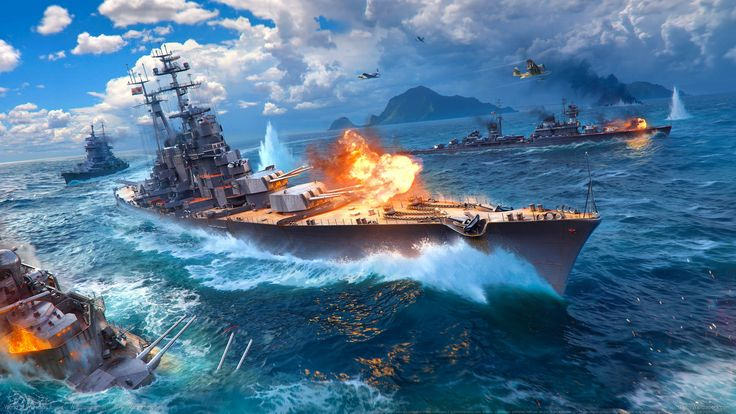

# Bataille Navale Description

Bienvenue Chers Joueurs,

Notre programme permet de jouer à la bataille navale avec les caractéristiques suivantes :

# Les règles 

-  Les joueurs jouent à tour de rôle.

- Le joueur actif tire sur une position (voir plus loin l’espace de jeu) et le programme répond :

    - « touché » si la position est occupé par un bateau et qu’il n’a pas été encore touché à cette
        position ;
    - « coulé » si la position est occupé par un bateau et que c’était la dernière position du bateau
        non encore touchée ;
    - « en vue » si la position n’est pas occupée par un bateau ou qu’elle correspond à une position
        déjà touchée, et que sur la ligne ou la colonne (ou les deux) se trouve une position non touchée
        occupée par un bateau ;
    - « île » si vous avez été maladroit et avez tiré sur une ile
    - « à l’eau » dans les autres cas

La partie est gagnée par le joueur actif si à la suite d’un tir, il coule le dernier bateau de la flotte de son
adversaire.

Chaque joueur peut visualiser :

- Son espace de jeu avec ses bateaux et l’indication des positions touchées de chaque bateau.
    - Les bateaux en vie sont représentés par des  □
    - Les bateaux touchés sont représentés par des  ╳
    - Les îles sont représentés par des  █
    - L'eau est représenté par une case vide
- Son espace de tir : le joueur actif peut savoir où il a déjà tiré.
    - Les bateaux touchés sont représentés par des  ╳
    - Les iles sont représentés par des  █
    - Un tir "en vue" est représenté par un  +
    - Un tir "à l'eau" est représenté par un  🞄
    - Une case qui n'a pas été tirée dessus est représentée par un  ?

# Les Bateaux 

Chaque joueur dispose de 5 bateaux de tailles 1 à 4, dont deux de taille 3.
Les bateaux sont disposés sur l’espace de jeu verticalement ou horizontalement (pas en diagonale) sur des
positions successives et adjacentes.
Deux bateaux ne peuvent pas partager la même position.
En début de partie, chaque joueur positionne ses bateaux sur son espace de jeu.

# Les Océans

L’espace de jeu est constitué de plusieurs océans, chacun étant identifié par un nom. Chaque océan est une
grille rectangulaire. Une position est donc déterminée par le nom de l’océan, la ligne et la colonne dans la
grille correspondante.
Les océans sont les suivants :
- l’océan atlantique de taille 6 × 7 ;
- l’océan pacifique de taille 7 × 8 ;
- l’océan Indien de taille 5 × 6.

Chaque océan comporte une île :
- une île des açores pour l’océan atlantique ;
- Hawaï pour l’océan pacifique ;
- La réunion pour l’océan Indien.

La taille de chaque île doit au moins être de 4 cases disposées comme vous le souhaitez.
Un bateau ne peut-être en vue que si il est sur le même océan que la position visée et qu’il n’est pas caché
par l’île.

# Mode de Jeu

- Facile : nombre de tirs illimité.
- Normal : nombre de tirs limité à 65.
- Difficile : nombre de tirs limité à 50.
- Extrême : nombre de tirs limités à 40
Dans les modes autre que facile, il peut y avoir match nul si aucune flotte n’a été entièrement coulé.

# Comment compiler et exécuter les fichiers?

Une fois que vous êtes dans le dossier avec les fichiers du projet, tapez la commande : " swiftc *.swift " (dans un terminal) pour compiler tous les fichiers. Ensuite, tapez la commande : "./main " pour éxécuter le programme.

Remarque : Terminal encodé en UTF-8 nécessaire

# Crédits

Notre équipe est composée de deux programmeurs passionnés, Rémi Jorge et Alexandre Deloire, dont les rôles sont indiqués ci-dessous:

- Producer & Game Designer : Rémi Jorge, Alexandre Deloire
- Technical Director : Rémi Jorge
- Studio Director : Alexandre Deloire
- Senior Map Artist : Rémi Jorge
- Senior Lead Test Analyst : Alexandre Deloire
- Senior Programmer : Rémi Jorge, Alexandre Deloire
- Development Support : Rémi Jorge
- Scrum Master : Alexandre Deloire
- Lead AI Programmer : Rémi Jorge

